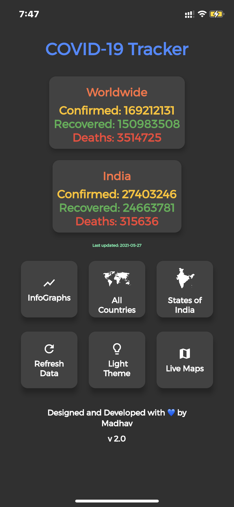
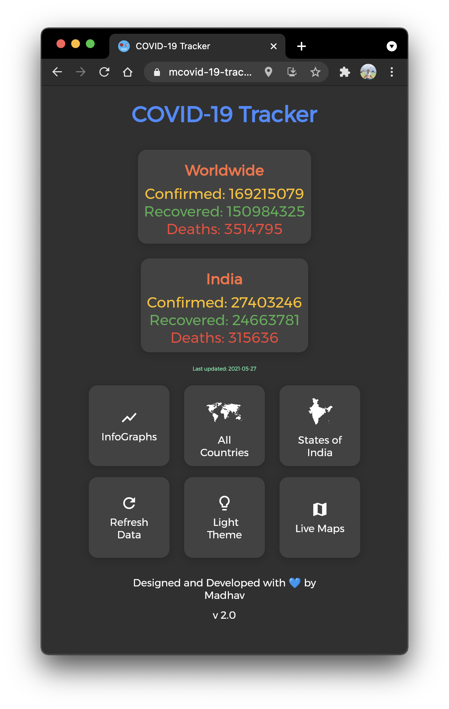
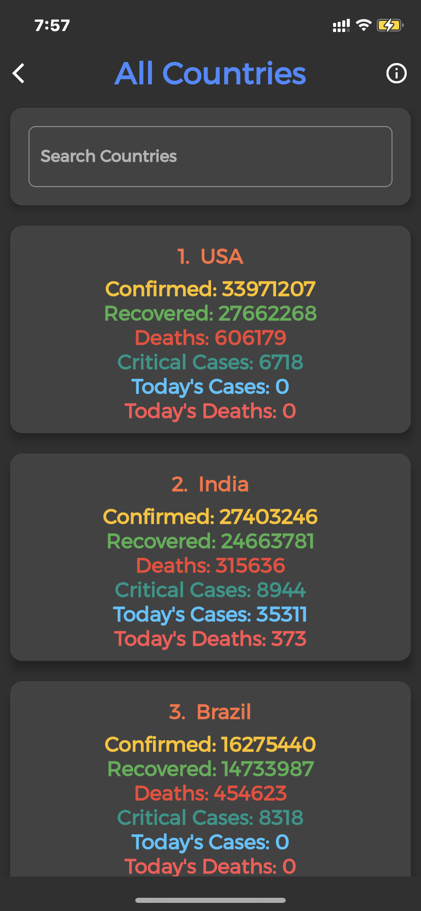
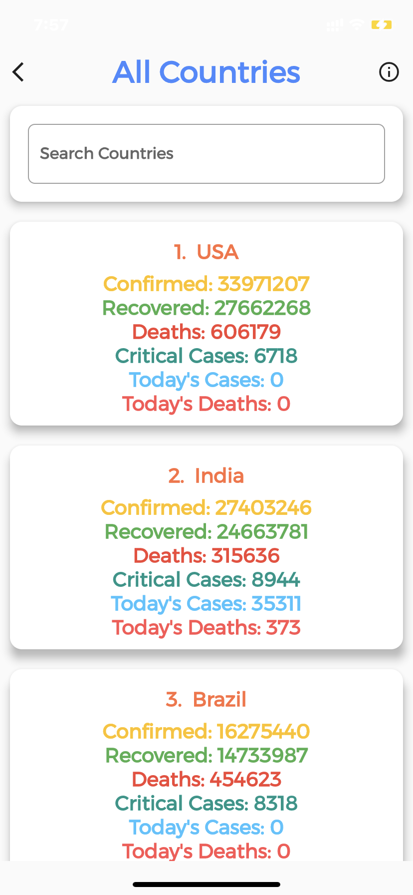
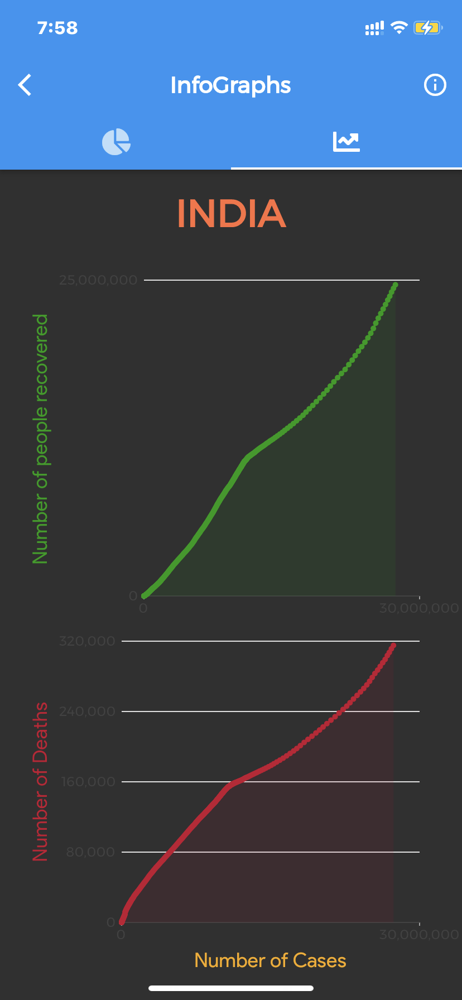
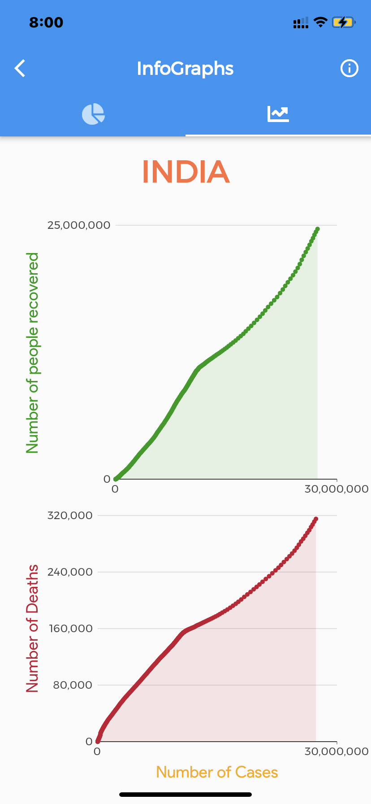
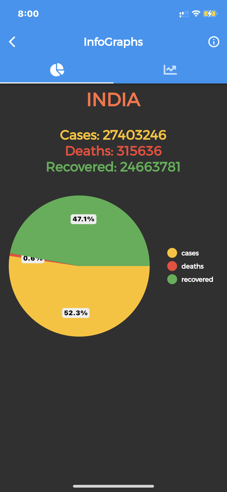
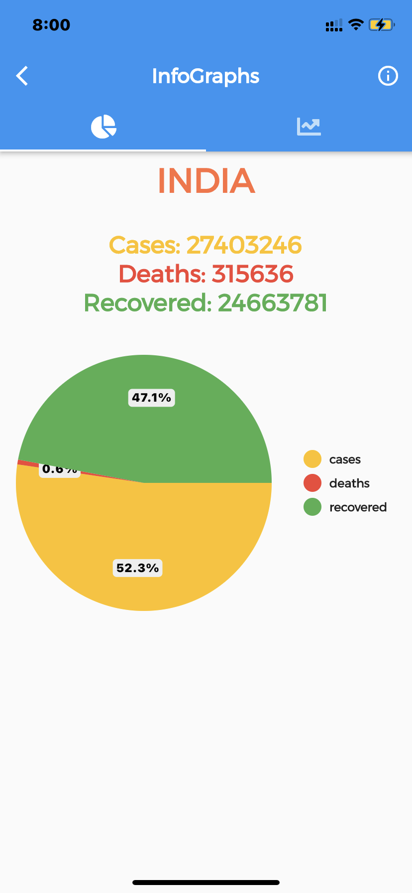
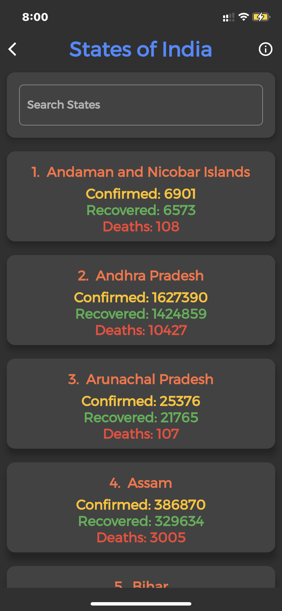
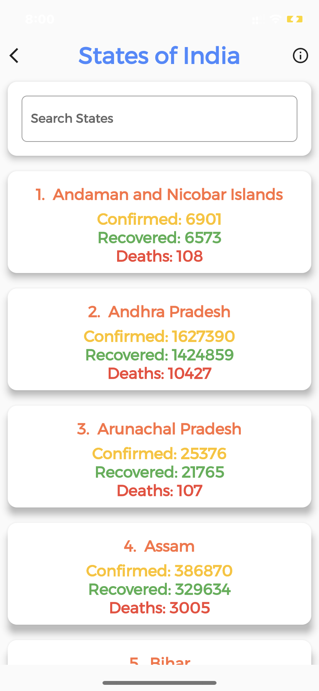

# COVID 19 TRACKER

A minimal App built using Flutter which shows live data about Corona Virus outbreak.

[PWA](https://mcovid-19-tracker.web.app/#/)
[APK](https://github.com/madhavtripathi05/COVID_19_TRACKER/releases/download/v2.0/app-release.apk)

# Dashboard

    
    

&nbsp;

## Features

- **Live data** : Get live data from [worldometers.info](https://www.worldometers.info/coronavirus/)
- **Live Maps** : Webview of Here Maps, Bing, WHO (select one from end Drawer).
- **Indian States** : Live data from [MOHFW](https://www.mohfw.gov.in/)
- **Search** : Added Search Option for ease of use.
- **Dark Theme** : Dark Theme to use during night.
- **Charts/InfoGraphs** : Get InfoGraphs for your Country.

## Steps to Run

1.  Open this project in Android Studio / VS Code.
2.  Get Dependencies by running: "pub get".
3.  For testing, run command "flutter run".

  
<strong>Screenshots</strong>
 
    
    
    
    
    
    
    
    
    
    

### APIs used

[disease-sh/API](https://github.com/disease-sh/API)
[amodm/api-covid19-in](https://github.com/amodm/api-covid19-in)
